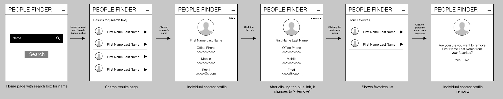

# People Finder

## Motivation

My motivation for this app is because we had a similar tool a few years ago at my company and IT decided to stop supporting it so it was sunsetted. I used it heavily when I was moving around from office to office and was dissapointed to see it go away. Alt

## Status

The current project is complete. If I have time, I might implement a feature where the office location links to a PDF floor plan and zooms in on the specific user's deck location. This would be a useful function for those who have meetings with someone that they haven't met or don't know where they sit within the office.npm 

## Wireframes

